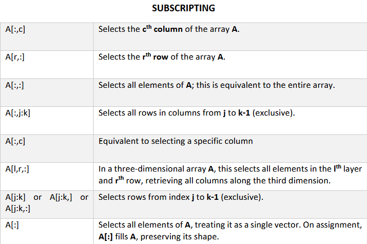
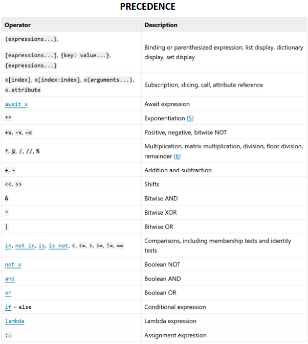

# Python Learning 🚀
<br>
For **Scientific Programming Course** which introduces the fundamentals of scientific programming languages. Emphasis is placed on fundamentals of programming, implementing algorithms, program design and visualization. The goal is to learn the skills in scientific computing, tools, techniques that can be used to solve engineering problems.
<br>
🐍
This course uses Python as its high level programming language with various libraries such as NumPy and Matplotlib, with VS Code as IDE.
Initially, this repo was used as my personal note taking stuff in class, with scipts for learning. Now, I want to learn to maintain a github repo through this. Hopefully I can make this neat and user friendly for my future viewers.

# [**Notes** ✍️](https://github.com/bropenguin847/Python-Learning/tree/main/Notes)
Contains notes for each chapter. Still updating the notes, when I have time.
For array notes, contain specific notes regarding numpy arrays.

# [**Exercises** ᕙ(  •̀ ᗜ •́  )ᕗ](https://github.com/bropenguin847/Python-Learning/tree/main/exercises)
In exercises folder, contain exercises for python, such as array manipulation, bubble sort and my mistakes that I have made during test (regretting life).
Some python files are combined together to reduce clutter and because the codes are very similar.

# **Assignment** 📚
In the assignment folder, contains 3 tasks. All requires using Python to extract data from csv file using Python libraries such as Pandas.
In the .py file, the problem scenario's are stated on the top.

# Scripts 📝
In Chapter 3 and Chapter 4, contains example code for each chapter. Can try out and find out how does each function work.
In Chapter 8, the folder for Signals is for Signals and System course. It's for assignment, the code is an alternative to plotting graphs using MatLab.

# Appendix 📌
Cheatsheet for subscripting and operator precedence



# Libraries 📖
Numpy, Matplotlib, Pandas & SciPy
```python
python -m pip install numpy
python -m pip install matplotlib
python -m pip install pandas
python -m pip install scipy
```
[🎲NumPy documentation](https://numpy.org/doc/stable/user/absolute_beginners.html)<br>
[📈MatPlotLib documentation](https://matplotlib.org/stable/index.html)<br>
[🔴🟠🟡🟢🔵🟣matplotlib colors](https://i.sstatic.net/lFZum.png)<br>
[🐼Pandas Documentation](https://pandas.pydata.org/docs/index.html)<br>
[SciPy Documentation](https://docs.scipy.org/doc/scipy/tutorial/index.html#user-guide)<br>